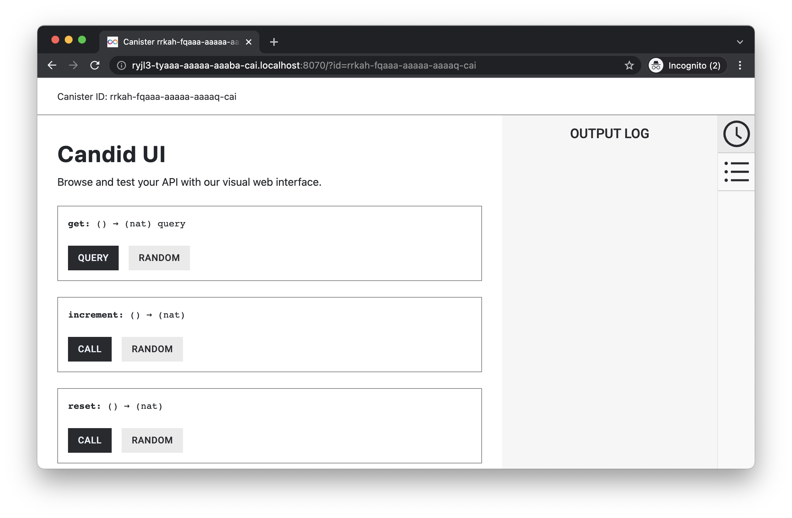

# Persistent Storage
The purpose of this example dapp is to build a simple counter dapp, where the counter value will persist even after the dapp has changed and been re-deployed.

This example covers:

- Create new canister smart contract using Motoko
- Add backend functions for a counter (increment, get count and reset count)
- Deploy the canister smart contract locally
- Test backend with Candid UI and command line using `dfx` 

